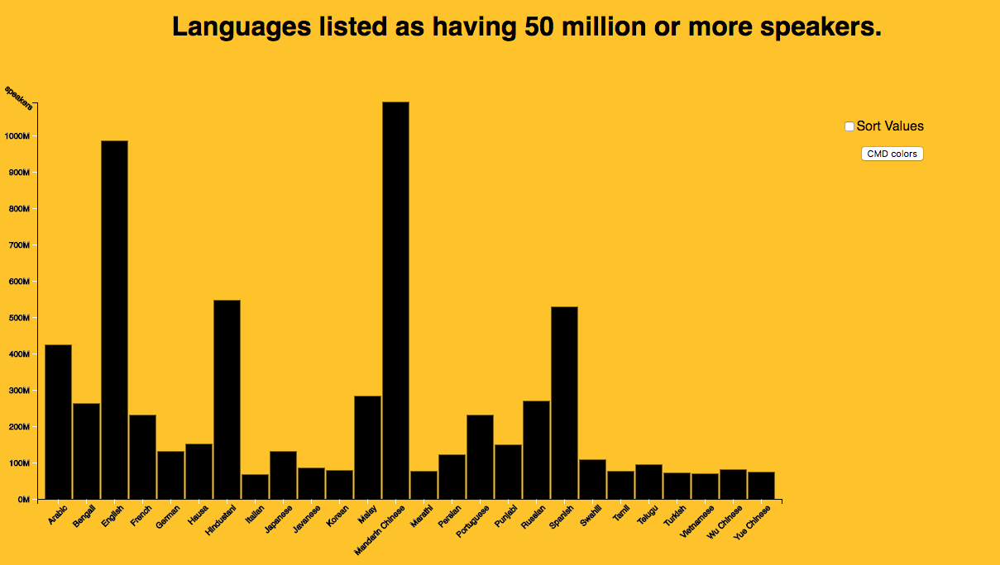

# Assessment

For my assessment I made a bar chart for the data of Top languages by number of speakers. I used the [bar chart](https://bl.ocks.org/mbostock/3885705) of @mbostock. 

## Background

The assessment is about working with data and cleaning it up so you can use it to your liking. I used the bar chart because it was the most fitting to my data. You have data for either axis and it is clear what language has the most and which doesn't.

I wanted my data to work but wanted it to feel like it's alive. So i picked the bar chart that was subtle but made the data obvious.




## What i had to do

The chart was made for [d3.v3](https://github.com/d3/d3/releases/v3.0.0) i had to refactor the code to [d3.v3](https://github.com/d3/d3/blob/master/API.md)

-   `d3.v3` to `d3.v4`
-   refactor `d3.scaleLinear()`
-   refactor `d3.scaleOrdinal()`
-   refactor `d3.extent()`
-   refactor `d3.axisBottom() or d3.axisLeft()`
-   refactor `time.format`
-   refactor to my style of coding.
-   Adjust the animation to make it work for `d3.v4`

### Style Used

I use single quotes for strings and every new piece of code gets a new line (for readability). I close every line of code but keep the DRY _(Don't Repeat Yourself)_ effect in tact.

For multiple variables I end on the latest line (in case you want to add more just `,` +  <button>enter</button> and add another one).

The next example you see how I use a function. array and loop.  
*   New line on every new entry in the array (same for objects).
*   Close the array on a line of his own.
*   Loop on the same line.
*   Code to execute on the next.
*   _Interested in de colors i used check out [dash-syntax for atom](https://github.com/cpsdqs/dash-syntax)_

```js
function myStyle() {
  var arrayColors = [
    '#ed9b50',
    '#ffb91b',
    '#5b85ff',
    '#8c63d9',
    '#dbe5ed',
    '#4ebc6b',
    '#f54784',
    '#43c5e5',
    '#46c999'
  ];

  for (var i = 0; i < arrayColors.length; i++) {
    console.log(arrayColors[i], 'colors');
  };
};
```

### features

[**d3 API**](https://github.com/d3/d3/blob/master/API.md)
-   [`d3.axisBottom() or d3.axisLeft()`](https://github.com/d3/d3-axis/blob/master/README.md)
-   [`d3.scaleOrdinal()`](https://github.com/d3/d3-3.x-api-reference/blob/master/Ordinal-Scales.md#ordinal)
-   [`d3.scaleLinear()`](https://github.com/d3/d3-scale/blob/master/README.md#scaleLinear)
-   [`.tickFormat(d3.formatPrefix('.0', 1e6))` (it looks alot like locale_format)](https://github.com/d3/d3-format#locale_format)
-   [`.scaleBand()`](https://github.com/d3/d3-scale/blob/master/README.md#scaleBand)
-   [`.rangeRound()`](https://github.com/d3/d3-scale/blob/master/README.md#continuous_rangeRound)
-   [`d3.ascending()`](https://github.com/d3/d3-array/blob/master/README.md#ascending)

### License

[The chart i used](https://bl.ocks.org/mbostock/3885705) is made by @mbostock (GPL-3.0).

[GPLv3](https://choosealicense.com/licenses/gpl-3.0/) Vincent Kempers 👨🏽‍💻
